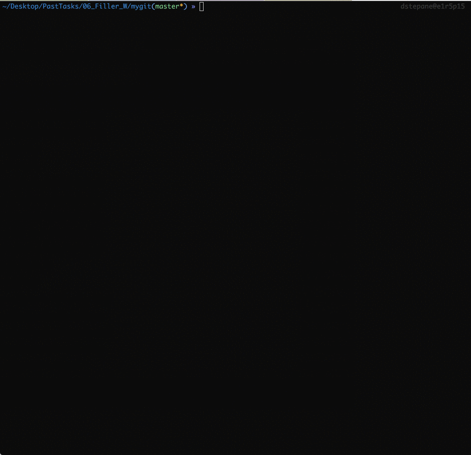

# Filler

Algorithmic game. Two bots place random pieces on a map, trying to occupy the most territory.



## Description

Two players take turns placing randomly generated pieces on a rectangle map. They earn a point for each covered square of a map. A piece must overlap one and only one square of 'friendly' territory, all other squares of its placement must be free. The game stops as soon as a given piece can no longer be placed. Wins the player who covered the larger area of a map.

The goal of this project is to write a bot which can win at least 3 of 5 games with every provided bot.

*This is the project of the Algorithms branch of the School 42 curriculum.*

**Detailed description of the task: [lem-in.en.pdf](https://github.com/dstepanets/Lem_in/blob/master/lem-in.en.pdf)**

## Usage

Compile with `make`. To run the game we use the virtual machine `filler_vm`, providing it with 2 players and a map.

```
./filler_vm -f <map> -p1 <player1.filler> -p2 <player2.filler>

   -f  --file		use a map file (required)
   -p1 --player1	use filler binary as a first player
   -p2 --player2	use filler binary as a second player

```

After compilation, my player `dstepane.filler` is placed in the root. The six enemy bots are in `players` directory. Three maps of different size in `maps` folder.

#### Visuals

There is a little bonus - a visual mode. Pipe the game output to the binary `visuals/visualizer` - and a battle will convert to emojis. For example:

```
./filler_vm -p1 ./dstepane.filler -p2 players/carli.filler -f maps/map01 | visuals/visualizer
```

**The program was tested only on Mac OS X.**

## Algorithm

Each turn we parse the VM output for an updated map and a piece to place. We must give VM coordinates of where to put the pice.  For example, while playing with 'O', my bot gets this map and a piece.

```
Plateau 15 17:
    01234567890123456
000 .................
001 .................
002 .................
003 .................
004 .................
005 .................
006 ...OOOOOOOOOOOOOO
007 ..OO........OOOOO
008 ..O.........OOXXX
009 ............OXXXX
010 ............OOXXX
011 ..............xxX
012 ...........X..XXX
013 ........XXXXXXXXX
014 ..........XXXXXXX
Piece 2 3:
.**
.**
```

The strategy is to place a piece as close to enemy's territory, as possible. This will limit his expansion.

To achieve this, my bot each turn generates a [heat map](https://en.wikipedia.org/wiki/Heat_map) of the territory. Squares closest to enemy are marked as preferred for placement.

Based on the map above, my bot generated this heat map. 

```
heat | 0 | 1 | 2 | 3 | 4 | 5 | 6 | 7 | 8 | 9 |10 |11 |12 |13 |14 |15 |16 |
000: |15 |15 |15 |15 |15 |15 |15 |15 |15 |16 |17 |18 |19 |20 |21 |22 |23 |
001: |14 |14 |14 |14 |14 |14 |14 |14 |15 |16 |17 |18 |19 |20 |21 |22 |23 |
002: |13 |13 |13 |13 |13 |13 |13 |14 |15 |16 |17 |18 |19 |20 |21 |22 |23 |
003: |12 |12 |12 |12 |12 |12 |13 |14 |15 |16 |17 |18 |19 |20 |21 |22 |23 |
004: |11 |11 |11 |11 |11 |12 |13 |14 |15 |16 |17 |18 |19 |20 |21 |22 |23 |
005: |10 |10 |10 |10 |11 |12 |13 |14 |15 |16 |17 |18 |19 |20 |21 |22 |23 |
006: | 9 | 9 | 9 |-1 |-1 |-1 |-1 |-1 |-1 |-1 |-1 |-1 |-1 |-1 |-1 |-1 |-1 |
007: | 8 | 8 |-1 |-1 | 6 | 6 | 5 | 5 | 5 | 5 | 5 | 5 |-1 |-1 |-1 |-1 |-1 |
008: | 8 | 7 |-1 | 5 | 5 | 5 | 5 | 4 | 4 | 4 | 4 | 4 |-1 |-1 | 0 | 0 | 0 |
009: | 8 | 7 | 6 | 5 | 4 | 4 | 4 | 4 | 3 | 3 | 3 | 3 |-1 | 0 | 0 | 0 | 0 |
010: | 8 | 7 | 6 | 5 | 4 | 3 | 3 | 3 | 3 | 2 | 2 | 2 |-1 |-1 | 0 | 0 | 0 |
011: | 8 | 7 | 6 | 5 | 4 | 3 | 2 | 2 | 2 | 2 | 1 | 1 | 1 | 1 | 0 | 0 | 0 |
012: | 8 | 7 | 6 | 5 | 4 | 3 | 2 | 1 | 1 | 1 | 1 | 0 | 1 | 1 | 0 | 0 | 0 |
013: | 8 | 7 | 6 | 5 | 4 | 3 | 2 | 1 | 0 | 0 | 0 | 0 | 0 | 0 | 0 | 0 | 0 |
014: | 8 | 7 | 6 | 5 | 4 | 3 | 2 | 1 | 1 | 1 | 0 | 0 | 0 | 0 | 0 | 0 | 0 |
```
* 0 - enemy's territory 
* -1 - my territory 
* other numbers - free squares (less value, closer to enemy)

So, each turn my program finds a valid with the lowest sum of free squares and puts a piece there. It wins very well :)
